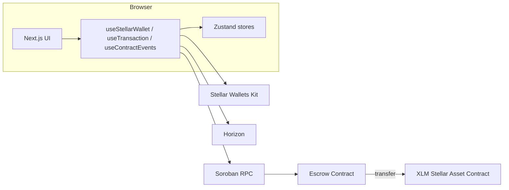

# Better Payments

A production-grade Next.js dapp for **escrow-based XLM payments** on the Stellar network. Sellers create escrow payment requests and share them as QR codes; buyers fund and release (or dispute/refund) those escrows through a multi-wallet interface. A Soroban smart contract holds funds in escrow, and the app streams contract events in real time.

> Configured for **Stellar Testnet** by default. All network endpoints and the contract ID are environment-driven, so migrating to another network is a matter of `.env` values.

## Features

- **Multi-wallet support**: Freighter, LOBSTR, xBull, and Albedo (via Stellar Wallets Kit), with silent reconnect persisted across sessions.
- **Full escrow lifecycle**: create → fund → release, plus **timeout refunds**, **disputes**, and **arbitrated resolution**.
- **Inter-contract calls**: the escrow contract moves XLM through a configurable Stellar Asset Contract (SAC) token client.
- **Real-time event log**: Soroban RPC polling with exponential backoff, topic filtering, and pagination.
- **Production UX**: optimistic updates, toast notifications, skeleton loaders, error boundaries, retry-with-backoff, and 44px touch targets on a responsive mobile-first layout.
- **Tested**: 16 Rust contract tests + fuzz target, and a Vitest/Testing-Library frontend suite.
- **CI/CD**: GitHub Actions for tests/build, a deploy workflow, a local deploy script, Docker, and pre-commit hooks.

## Documentation

| Doc                                          | Contents                                                             |
| -------------------------------------------- | -------------------------------------------------------------------- |
| [docs/ARCHITECTURE.md](docs/ARCHITECTURE.md) | System components, data flow, security model, storage & TTL strategy |
| [docs/DEPLOYMENT.md](docs/DEPLOYMENT.md)     | Local deploy script, CI/CD pipelines, contract ID management, Docker |
| [docs/DEMO.md](docs/DEMO.md)                 | Step-by-step demo script and common pitfalls                         |

## Architecture at a glance



## Tech Stack

- [Next.js 16](https://nextjs.org/) (App Router + Turbopack), [TypeScript](https://www.typescriptlang.org/), [Tailwind CSS v4](https://tailwindcss.com/)
- [Stellar SDK](https://github.com/stellar/js-stellar-sdk) + [Stellar Wallets Kit](https://stellarwalletskit.dev/)
- [Soroban SDK](https://github.com/stellar/rs-soroban-sdk) (Rust) for the escrow contract
- [Zustand](https://github.com/pmndrs/zustand) state, [Sonner](https://sonner.emilkowal.ski/) toasts, [lucide-react](https://lucide.dev/) icons
- [Vitest](https://vitest.dev/) + [Testing Library](https://testing-library.com/) for the frontend; `cargo test` + `cargo-fuzz` for the contract

## Getting Started

### 1. Install dependencies

```bash
pnpm install
```

### 2. Configure environment

```bash
cp .env.local.example .env.local
```

Defaults point to Stellar Testnet. After deploying the escrow contract, set `NEXT_PUBLIC_ESCROW_CONTRACT_ID`.

| Variable                         | Required    | Description                                                             |
| -------------------------------- | ----------- | ----------------------------------------------------------------------- |
| `NEXT_PUBLIC_STELLAR_NETWORK`    | no          | Network label (default `testnet`)                                       |
| `NEXT_PUBLIC_HORIZON_URL`        | no          | Horizon endpoint                                                        |
| `NEXT_PUBLIC_SOROBAN_RPC_URL`    | no          | Soroban RPC endpoint                                                    |
| `NEXT_PUBLIC_NETWORK_PASSPHRASE` | no          | Network passphrase                                                      |
| `NEXT_PUBLIC_FRIENDBOT_URL`      | no          | Friendbot funding endpoint                                              |
| `NEXT_PUBLIC_ESCROW_CONTRACT_ID` | **yes**     | Deployed escrow contract ID (validated at load in the browser)          |
| `NEXT_PUBLIC_TOKEN_ADDRESS`      | no          | SAC token address used for transfers (defaults to native XLM SAC)       |
| `ADMIN_ADDRESS`                  | deploy only | Admin set during `initialize` (server-side, not exposed to the browser) |
| `ESCROW_TIMEOUT_SECONDS`         | deploy only | Default refund timeout (seconds) set at `initialize`                    |

### 3. Run the development server

```bash
pnpm dev
```

Open [http://localhost:3000](http://localhost:3000).

### 4. Install and configure a wallet

Install [Freighter](https://www.freighter.app/), [LOBSTR](https://lobstr.co/), [xBull](https://xbull.app/), or [Albedo](https://albedo.link/), create/import a wallet, and switch it to **Testnet**.

### 5. Run the escrow flow

See [docs/DEMO.md](docs/DEMO.md) for the full walkthrough.

## Contract API

### Methods

| Method                                                                                 | Auth                | Description                                                               |
| -------------------------------------------------------------------------------------- | ------------------- | ------------------------------------------------------------------------- |
| `initialize(admin, timeout_seconds, xlm_sac_address)`                                  | admin               | One-time setup of admin, default timeout, and token                       |
| `create_escrow(seller, buyer, amount, memo, arbitrator?)`                              | seller              | Creates a `Created` escrow, returns its `id`                              |
| `fund_escrow(id)`                                                                      | buyer               | Pulls `amount` from buyer into the contract, sets `Funded` + `timeout_at` |
| `release_escrow(id)`                                                                   | buyer               | Sends funds to seller, sets `Released`                                    |
| `refund_escrow(id)`                                                                    | buyer               | After `timeout_at`, refunds buyer, sets `Refunded`                        |
| `dispute_escrow(caller, id)`                                                           | buyer or seller     | Marks a funded escrow `Disputed`                                          |
| `resolve_dispute(resolver, id, to_seller)`                                             | admin or arbitrator | Sends funds to seller/buyer, sets `Resolved`                              |
| `set_admin` / `set_timeout` / `set_token`                                              | admin               | Update configuration                                                      |
| `pause` / `unpause`                                                                    | admin               | Emergency stop for state-changing methods                                 |
| `get_escrow(id)` / `admin()` / `timeout_seconds()` / `token_address()` / `is_paused()` | —                   | Read-only views                                                           |

### Statuses

`Created → Funded → Released` (happy path), or from `Funded`: `→ Refunded` (timeout), `→ Disputed → Resolved` (arbitration).

### Events

`EscrowCreated`, `EscrowFunded`, `EscrowReleased`, `EscrowRefunded`, `EscrowDisputed`, `EscrowResolved`.

### Errors

`EscrowNotFound`, `InvalidAmount`, `Unauthorized`, `AlreadyFunded`, `AlreadyReleased`, `NotFunded`, `RefundNotAvailable`, `AlreadyDisputed`, `NotDisputed`, `AlreadyRefunded`, `ContractPaused`, `NotInitialized`, `AlreadyInitialized`.

## Scripts

| Command                             | Description                                 |
| ----------------------------------- | ------------------------------------------- |
| `pnpm dev`                          | Start the development server                |
| `pnpm build`                        | Production build (standalone output)        |
| `pnpm start`                        | Start the production server                 |
| `pnpm lint`                         | Run ESLint                                  |
| `pnpm format` / `pnpm format:check` | Prettier write / check                      |
| `pnpm test`                         | Run the frontend test suite (Vitest)        |
| `pnpm test:watch`                   | Vitest in watch mode                        |
| `pnpm test:coverage`                | Frontend tests with coverage                |
| `pnpm contract:build`               | Build the Soroban escrow WASM               |
| `pnpm contract:test`                | Run the contract test suite                 |
| `pnpm contract:deploy`              | Deploy the contract via `scripts/deploy.sh` |

## Testing

```bash
# Contract
cd contract && cargo test

# Frontend
pnpm test
```

## Deploying

See [docs/DEPLOYMENT.md](docs/DEPLOYMENT.md). Quick local deploy:

```bash
# fill in ADMIN_ADDRESS in .env.local first
pnpm contract:deploy
```

## Project Structure

```
better-payments/
├── contract/              # Rust Soroban escrow contract
│   ├── src/lib.rs         # Contract logic
│   ├── src/test.rs        # Unit/integration tests
│   └── fuzz/              # cargo-fuzz target
├── src/
│   ├── app/               # Next.js App Router pages & providers
│   ├── components/        # React components (+ co-located tests)
│   ├── hooks/             # useStellarWallet, useTransaction, useContractEvents
│   ├── lib/               # Stellar, transaction, balance, QR utilities
│   ├── store/             # Zustand wallet & escrow stores
│   └── test/              # Vitest setup
├── .github/workflows/     # CI and deploy pipelines
├── scripts/deploy.sh      # Local deployment script
├── Dockerfile             # Multi-stage build
└── docs/                  # Architecture, deployment, and demo docs
```

## Notes

- Contract events are polled from Soroban RPC (streaming is not yet supported by RPC).
- The escrow contract uses the Stellar Asset Contract (SAC) for native XLM transfers, configurable via `set_token`.
- State is updated **before** external token transfers to keep transitions re-entrancy-safe.
