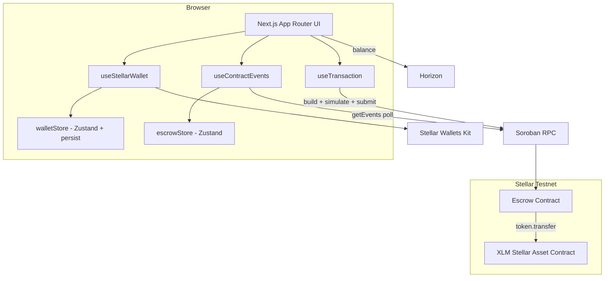
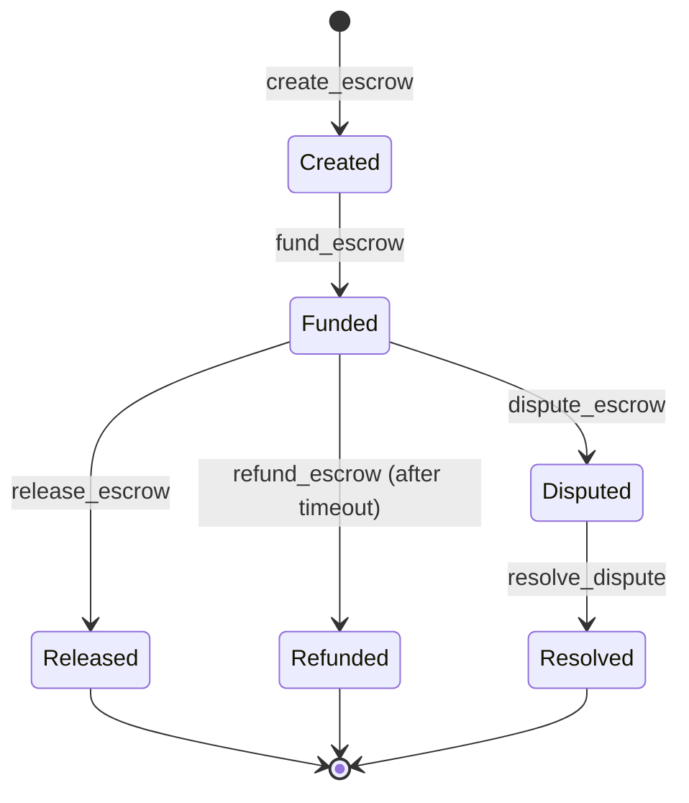

# Architecture

Better Payments is a Stellar dapp split into four layers: a Soroban smart contract, a state layer, a UI/hook layer, and a DevOps layer. This document describes the components, data flow, security model, and storage strategy.

## System components

### Layers

- **Contract layer** (`contracts/src/lib.rs`): the escrow state machine and all fund custody. It never trusts the client — every state-changing method authenticates the relevant party and validates the current status.
- **State layer** (`src/store/`): `walletStore` persists wallet identity to `localStorage` for silent reconnect; `escrowStore` caches escrows by ID and tracks pending/optimistic status.
- **UI/hook layer** (`src/components/`, `src/hooks/`, `src/lib/`): hooks orchestrate wallet, transactions, and event polling; `lib/transactions.ts` builds, simulates, signs, and submits Soroban operations; components render the lifecycle.
- **DevOps layer** (`.github/`, `scripts/`, `Dockerfile`): CI, deploy automation, containerization, and pre-commit hooks.

## Data flow: a transaction

1. A component calls `useTransaction.execute(buildTx)`.
2. `buildTx` (in `lib/transactions.ts`) assembles the contract invocation, **simulates** it against Soroban RPC to populate the footprint/auth, and returns the prepared XDR.
3. `useStellarWallet.sign` hands the XDR to the connected wallet via Stellar Wallets Kit.
4. The signed XDR is submitted; the hook polls for the result, then surfaces a toast and the transaction hash.
5. `escrowStore` is updated optimistically during the call and reconciled with a fresh `get_escrow` read afterward.

State transitions are phased `building → signing → submitting → success | error`, with up to 3 retries and exponential backoff on transient RPC failures. Wallet rejections are detected and **not** retried.

## Event streaming

`useContractEvents` polls Soroban RPC `getEvents` for the escrow contract:

- Exponential backoff on RPC errors (capped ~30s).
- In-flight requests aborted on unmount via `AbortController`.
- Full topic-array parsing, mapping to `EscrowCreated/Funded/Released/Refunded/Disputed/Resolved`.
- Topic filtering and pagination in `EventLog`, keeping the last 100 events.

Soroban RPC does not support push streaming, so polling is the supported real-time mechanism.

## Security model

- **Authorization**: every state-changing contract method calls `require_auth` on the acting party. `dispute_escrow` and `resolve_dispute` take an explicit caller/resolver `Address` (the SDK removed `env.invoker()`), and verify it against the buyer/seller or admin/arbitrator before requiring its auth.
- **Re-entrancy safety**: status is written to storage **before** any external `token.transfer`, so a re-entrant call observes the post-transition state.
- **Timeouts**: `timeout_at` is stamped at funding time from the configurable `TimeoutSeconds`. Refunds are only available to the buyer after `timeout_at`.
- **Dispute resolution**: only the escrow's `arbitrator` (set at creation) or the contract `admin` can resolve a dispute, directing funds to seller or buyer.
- **Pausability**: an admin `pause`/`unpause` flag gates create/fund/release/refund/dispute/resolve as an emergency stop.
- **Initialization guard**: state-changing methods require prior `initialize`; `initialize` is one-time and admin-authenticated.
- **Frontend fail-fast**: `lib/stellar.ts` validates required `NEXT_PUBLIC_*` variables in the browser at module load.

## Storage layout & TTL

Instance storage (configuration):

| Key              | Value                       |
| ---------------- | --------------------------- |
| `Admin`          | admin `Address`             |
| `TimeoutSeconds` | default refund window       |
| `Token`          | SAC token `Address`         |
| `Paused`         | bool emergency flag         |
| `EscrowCounter`  | monotonically increasing ID |

Persistent storage (per escrow): `Escrow(id) -> Escrow { id, seller, buyer, amount, memo, status, created_at, timeout_at, arbitrator }`.

Every read/write extends TTL (`extend_ttl(100, 518400)`) on both the instance entry and the touched escrow entry, keeping active escrows and configuration alive while idle entries are allowed to expire.

## Escrow state machine

